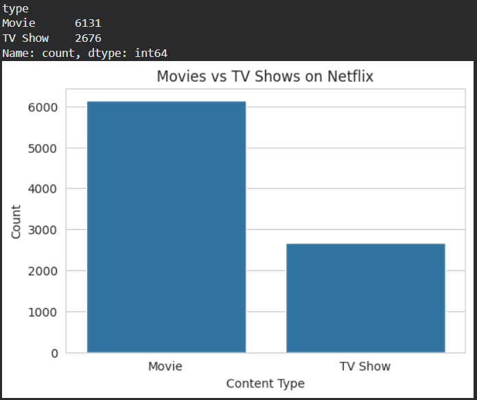
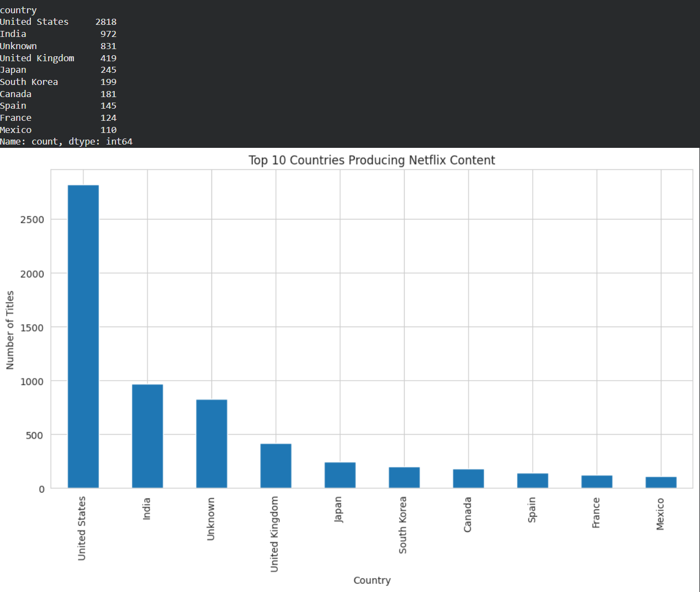
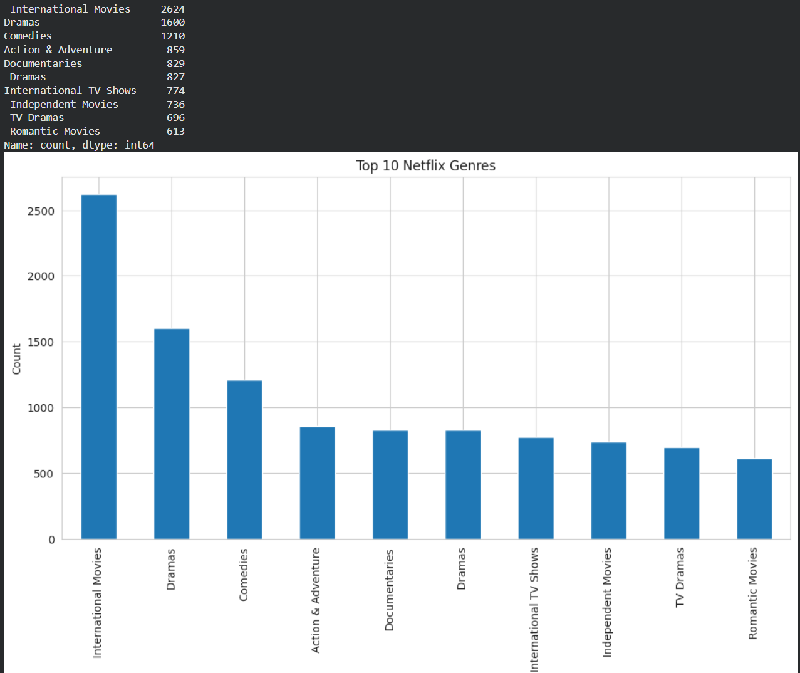
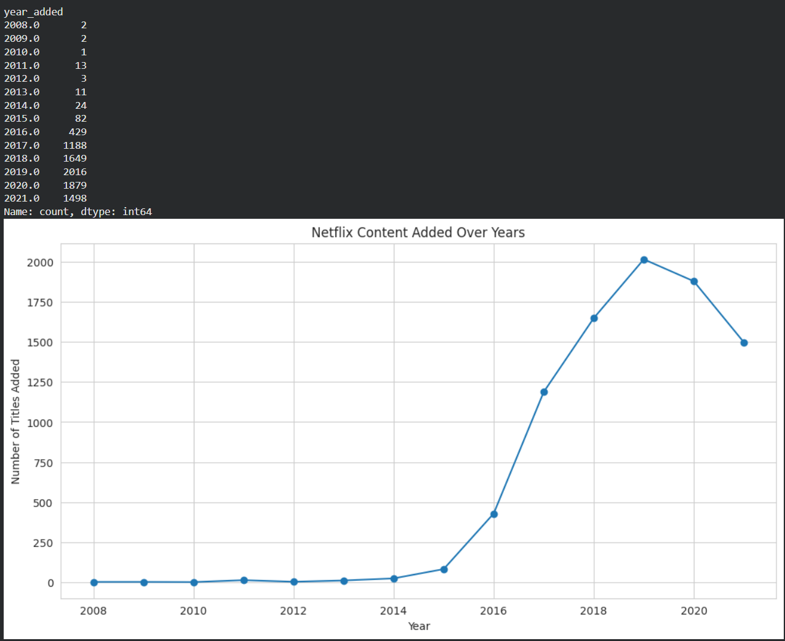
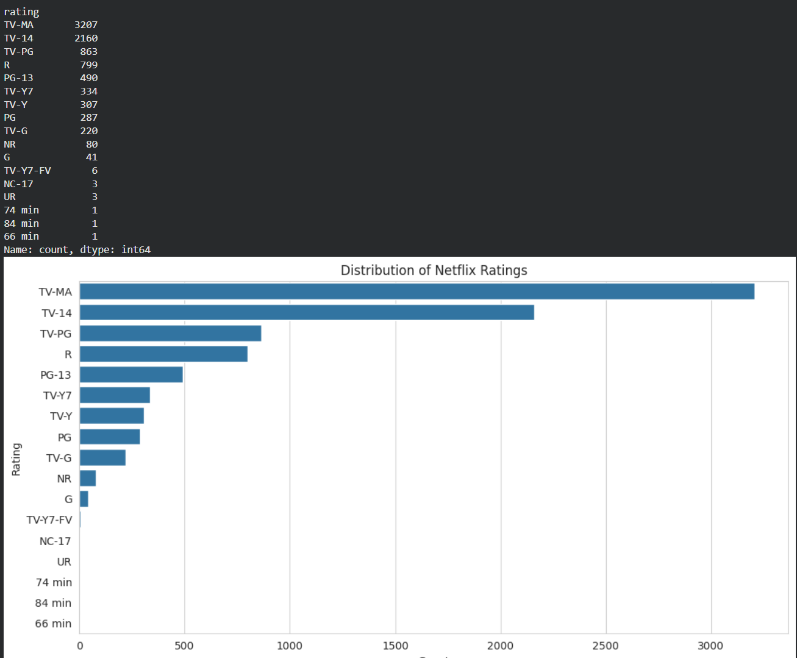
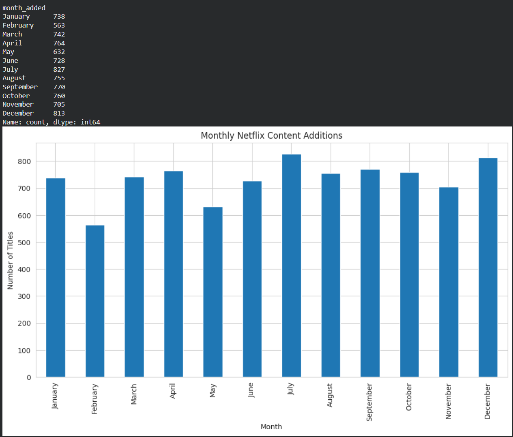
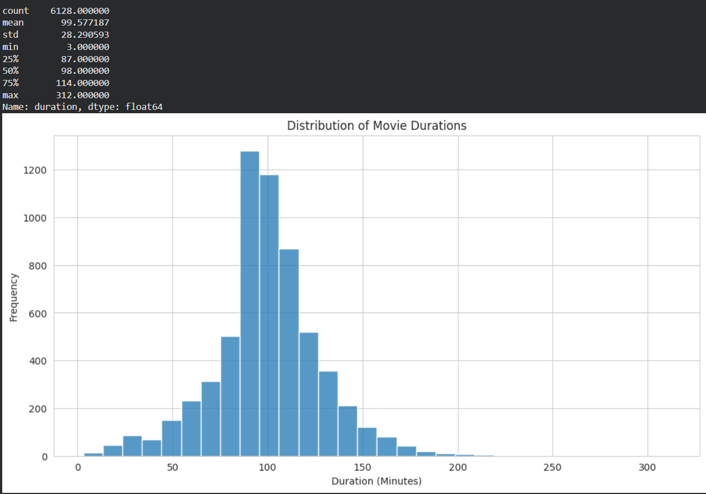
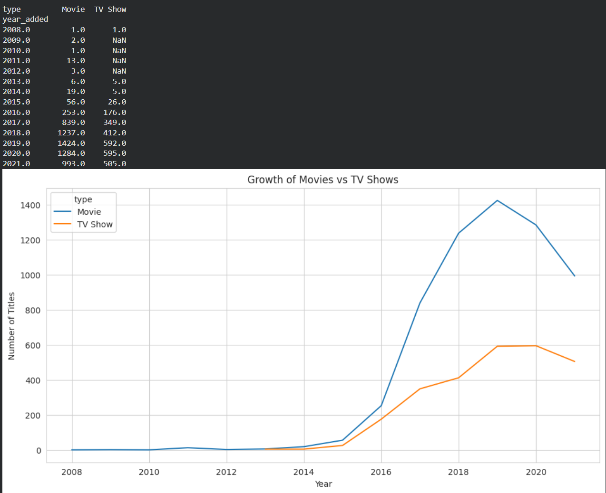
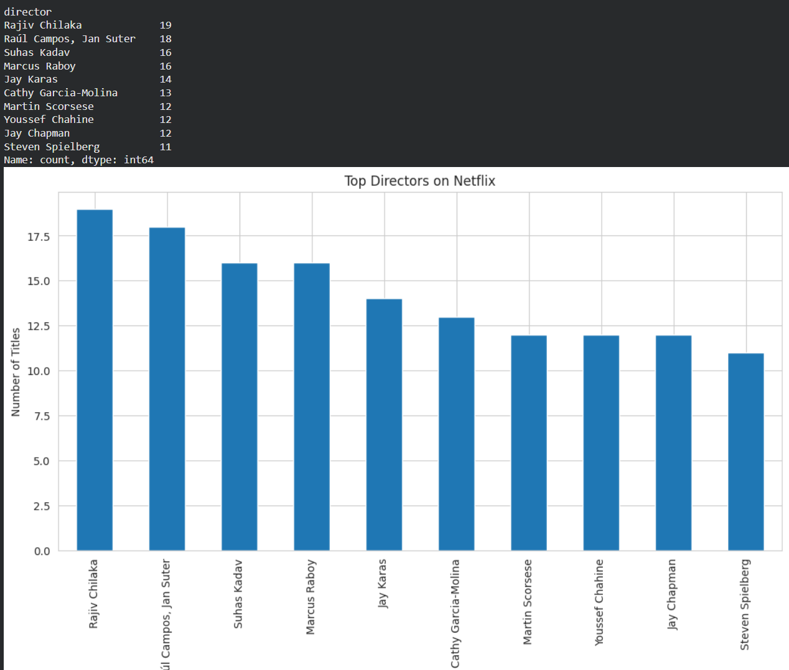

# Netflix Content Strategy Analysis 📺

# 🎬 About Netflix

Netflix is one of the world’s leading streaming platforms offering Movies, TV Shows, Documentaries, and Original Content across multiple countries and languages.

Founded in 1997, Netflix has expanded globally and serves millions of users through subscription-based digital entertainment services.

This project analyzes Netflix’s content library to identify trends, audience preferences, and business growth patterns using Exploratory Data Analysis (EDA).


## 📌 Project Overview

This project analyzes Netflix’s content library using Python to identify trends, audience preferences, and business growth patterns.

The goal of this analysis is to solve real-world business questions related to Netflix’s content strategy and audience engagement.

---

# 🎯 Business Problem Statement

Netflix wants to understand:

- What type of content performs best
- Which countries produce the most content
- What genres are most popular
- How content has grown over time
- Which audience categories dominate the platform

This analysis helps generate business insights and strategic recommendations.

---

# ❓ Business Questions Solved

## 1. What type of content dominates Netflix?
- Movies vs TV Shows analysis

Movies dominate the Netflix platform.



## 2. Which countries produce the most Netflix content?
- Country-wise content contribution

USA contributes the highest Netflix content.



## 3. Which genres are most popular?
- Genre trend analysis

Drama and International genres are highly popular.



## 4. How has Netflix content grown over time?
- Year-wise growth analysis

Netflix content expanded rapidly after 2015.




## 5. Which audience ratings are most common?
- Audience targeting analysis

TV-MA and TV-14 dominate the platform.



## 6. Which month sees the highest content additions?
- Seasonal release analysis

Netflix adds more content during specific months.



## 7. What is the average duration of Netflix movies?
- Viewer consumption pattern analysis

Most movies fall between 80–120 minutes.



## 8. Are Movies or TV Shows growing faster?
- Content strategy evolution

TV Shows have grown rapidly in recent years.



## 9. Which directors appear most frequently?
- Creative partnership analysis

Certain directors frequently collaborate with Netflix.




# 🛠 Tools & Technologies Used

- Python
- Pandas
- NumPy
- Matplotlib
- Seaborn
- Jupyter Notebook

---

# 📊 Key Insights

- Movies dominate Netflix content library
- TV Shows are growing rapidly
- USA contributes the highest amount of content
- Drama and International genres are highly popular
- Mature audience content dominates the platform
- Netflix content expanded rapidly after 2015

---

# 💡 Business Recommendations

- Expand investments in international content
- Increase high-retention TV Show production
- Balance mature and family-friendly content
- Optimize seasonal release strategies
- Strengthen partnerships with successful creators

---


# 📂 Project Structure

```bash
Netflix-Content-Analysis/
│
├── data/
├── notebook/
├── images/
├── README.md
└── requirements.txt
```

---

# 📈 Conclusion

This project demonstrates how Exploratory Data Analysis (EDA) can be used to solve real-world business problems using data-driven insights and visualization techniques.

The analysis helps understand Netflix’s content strategy, audience behavior, and global expansion trends.

---

# 📁 Dataset

Netflix Titles Dataset from Kaggle:
https://www.kaggle.com/datasets/shivamb/netflix-shows
